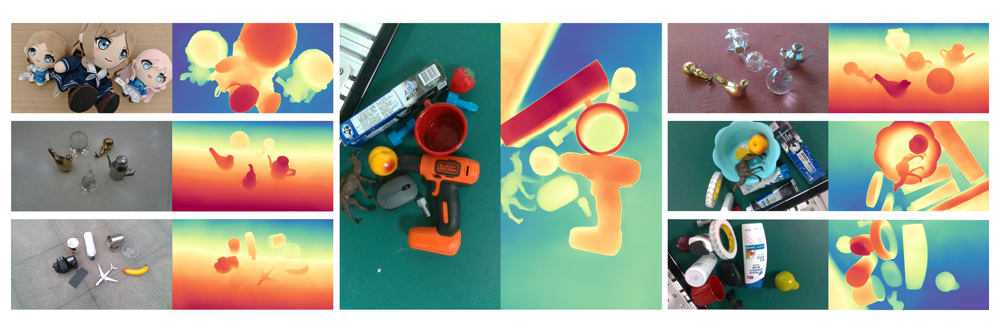
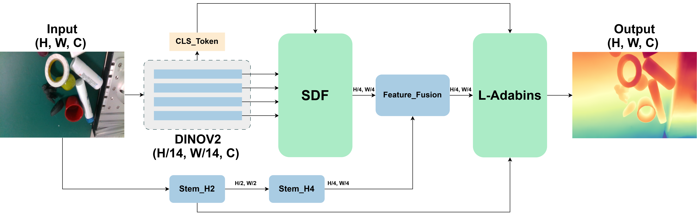
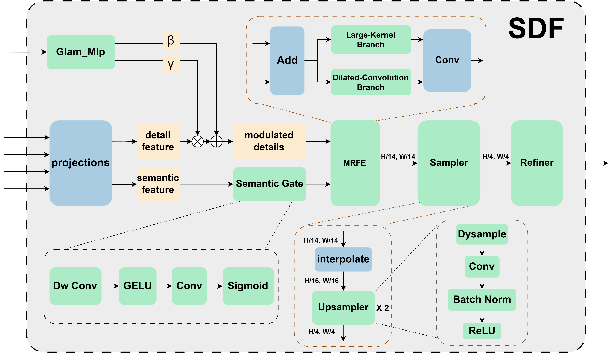
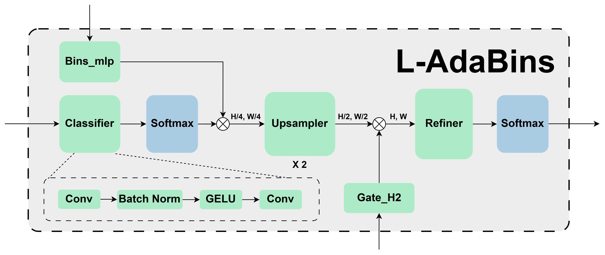

<div align="center">

# NearDepth: Lightweight Close-Range Monocular Depth Estimation

### Semantic-Driven Feature Decoding and Lightweight Adaptive Binning

[](#-quick-start)
[](#-intro)
[](#-evaluation)
[](#license)



**NearDepth: Semantic-Driven Feature Decoding and Lightweight Adaptive Binning for Close-Range Monocular Depth Estimation**

Shanghai University of Electric Power

</div>

## 🏃 Intro

We present **NearDepth**, an efficient monocular relative-depth estimation framework designed for close-range scenes with stacked objects, dense occlusions, thin structures, and frequent depth discontinuities. NearDepth uses a mostly frozen **DINOv2 ViT-S/14** encoder and replaces the heavy DPT decoder with a compact **Semantic-Driven Feature Decoder (SDF)**. A lightweight adaptive-binning head, **L-AdaBins**, then predicts image-adaptive relative-depth bins without a Transformer-based bin generator.

**Key features:**

* **Semantic-driven decoding:** the global CLS token modulates multilevel detail features, while the deepest feature provides spatial semantic gating.

* **Multi-receptive-field enhancement:** large-kernel depthwise and dilated-convolution branches aggregate complementary local and contextual information.

* **Lightweight adaptive binning:** L-AdaBins predicts bin widths directly from the CLS token in inverse-relative-depth space.

* **Dynamic upsampling:** DySample-based stages progressively recover a full-resolution depth distribution.

* **RGB guidance:** shallow RGB features provide auxiliary contour cues for close-range boundaries and slender structures.

* **Efficient decoder:** SDF reduces decoder parameters by **86.2%** and GFLOPs by approximately **27%** compared with DPT under the same backbone and evaluation setting.

### Overall framework

<p align="center">
  
</p>

The partially frozen DINOv2 backbone extracts four intermediate feature maps and a global CLS token. SDF produces an `H/4 × W/4` semantic-geometric representation, which is fused with shallow RGB features and passed to L-AdaBins for full-resolution relative-depth prediction.

### Core components

<table>
  <tr>
    <td width="50%" align="center"><strong>Semantic-Driven Feature Decoder (SDF)</strong></td>
    <td width="50%" align="center"><strong>Lite Adaptive Binning (L-AdaBins)</strong></td>
  </tr>
  <tr>
    <td></td>
    <td></td>
  </tr>
  <tr>
    <td valign="top">CLS-conditioned affine modulation and deep semantic gating route detail features into MRFE. Large-kernel depthwise and dilated convolutions provide complementary receptive fields before lightweight dynamic upsampling.</td>
    <td valign="top">A small MLP predicts global adaptive bin widths from the CLS token. Pixel-wise bin logits are progressively upsampled, refined, and converted into a relative-depth estimate through an expectation over adaptive bin representatives.</td>
  </tr>
</table>

## ⚡ Quick Start

### Environment

```bash
conda create -n neardepth python=3.10 -y
conda activate neardepth
pip install torch torchvision timm opencv-python pillow numpy matplotlib tqdm
```

NearDepth loads DINOv2 from a local `torch.hub` checkout. Place a compatible DINOv2 repository at:

```text
pretrained_model/DINOV2/
```

The expected backbone entry is `dinov2_vits14_reg`.

### Model usage

```python
import torch

from networks.NearDepth import NearDepth

device = torch.device("cuda" if torch.cuda.is_available() else "cpu")
model = NearDepth(img_size=(360, 640), neck_type="sdf").to(device)
model.eval()

images = torch.randn(1, 3, 360, 640, device=device)
with torch.no_grad():
    relative_depth, bin_edges = model(images)

print(relative_depth.shape)  # [1, 1, 360, 640]
```

The available decoder settings are:

* `sdf`: the proposed Semantic-Driven Feature Decoder.

* `dpt_official`: the DPT-style decoder used for the controlled comparison.

* `dpt_custom`: an additional project-local DPT variant for ablation studies.

### Training

Set the GraspNet and DREDS root paths in `train.py`, then run:

```bash
python train.py --neck-type sdf --epochs 11 --batch-size 16
```

For decoder comparisons:

```bash
python train.py --neck-type dpt_official --exp-suffix dpt
python train.py --neck-type dpt_custom --exp-suffix dpt_custom
```

The training script jointly samples the configured GraspNet and DREDS datasets and writes checkpoints, histories, curves, and visualizations to `experiments/<experiment-name>/`.

The active objective follows affine-invariant relative-depth supervision:

```text
L = L_ssi + 2.0 L_grad
```

where `L_ssi` is a scale-and-shift-invariant loss in inverse-depth space and `L_grad` is a multiscale gradient-matching loss.

## 📦 Datasets

NearDepth is trained with complementary real and synthetic data. Each dataset serves a different role:

| Dataset      | Type      | Scene focus                                      | Supervision          | Role                                                                        |
| ------------ | --------- | ------------------------------------------------ | -------------------- | --------------------------------------------------------------------------- |
| **GraspNet** | Real      | Close-range object stacking and robotic grasping | Refined pseudo depth | Real appearance, object boundaries, occlusions, and sensor-domain variation |
| **DREDS**    | Synthetic | Close-range tabletop scenes                      | Ground-truth depth   | Dense geometric supervision and unseen-object evaluation                    |
| **Hypersim** | Synthetic | Diverse indoor environments                      | Ground-truth depth   | Indoor layout, material, and viewpoint diversity                            |

GraspNet sensor depth contains holes and local noise around reflective surfaces, occlusions, and thin structures. In the paper, dense Depth Pro predictions are aligned with valid sensor measurements and used as refined pseudo labels. This improves supervision density while the final model remains affine-invariant rather than metric-scale.

### Pseudo-label preparation with Depth Pro

We provide two utilities under `tools/` for preparing and checking dense GraspNet supervision. They build on Apple's official [Depth Pro](https://github.com/apple/ml-depth-pro) implementation; install Depth Pro and download its pretrained checkpoint by following the instructions in that repository before running inference.

1. `tools/infer_folder.py` performs batched Depth Pro inference over an image folder. Predictions are converted from meters to millimeters and saved as single-channel 16-bit PNG files.

   ```bash
   python tools/infer_folder.py \
       --input_folder /path/to/realsense/rgb \
       --output_folder /path/to/realsense/synthetic_depth \
       --precision fp16
   ```

2. `tools/debug.py` pairs sensor depth with the generated `synthetic_depth` maps, checks file type, shape, invalid pixels, and depth statistics, and reports Raw, P1–P99, and P5–P95 metrics. With `--use_align`, it additionally estimates a per-image median scale factor and evaluates the scale-aligned predictions.

   ```bash
   python tools/debug.py \
       --root_dir /path/to/graspnet_dataset \
       --mode train \
       --num 400 \
       --use_align
   ```

`debug.py` reports the estimated alignment factors and post-alignment metrics; it does not overwrite the generated PNG files.

The released dataset utilities provide GraspNet and DREDS loading, camera normalization, augmentation, evaluation preprocessing, padding, pseudo-label inference, and scale-alignment diagnostics. Dataset files and generated pseudo labels are not redistributed.

### Expected GraspNet layout

```text
graspnet_dataset/
└── train_*/
    └── scene_*/
        └── realsense/
            ├── rgb/*.png
            ├── depth/*.png
            └── camK.npy
```

### Expected DREDS layout

```text
DREDS_CatKnown_Dataset/
└── train_part{0..4}/
    └── part{0..4}/
        └── <scene>/
            ├── 0000_color.jpg
            ├── 0000_depth_120.exr
            └── ...
```

Please obtain GraspNet, DREDS, and Hypersim from their official project pages and comply with their respective licenses. Hypersim is part of the paper's broader training setup; its loader is not included in this public code snapshot.

## 📊 Evaluation

NearDepth predicts a positive, dimensionless **relative-depth coordinate**. Before evaluation, predictions are aligned with ground truth using a per-image scale and shift over valid pixels. The reported values measure relative depth structure rather than absolute metric scale.

### Affine-invariant monocular depth estimation

| Method               | Encoder      | NYUv2 AbsRel ↓ | NYUv2 RMSE ↓ | NYUv2 δ1 ↑ | DREDS Novel AbsRel ↓ | DREDS Novel RMSE ↓ | DREDS Novel δ1 ↑ | GraspNet Novel AbsRel ↓ | GraspNet Novel RMSE ↓ | GraspNet Novel δ1 ↑ |    Params ↓ |
| -------------------- | ------------ | -------------: | -----------: | ---------: | -------------------: | -----------------: | ---------------: | ----------------------: | --------------------: | ------------------: | ----------: |
| Depth Anything V2    | DINOv2 ViT-S |          0.082 |        0.305 |      0.927 |                0.043 |              0.053 |            0.981 |                   0.059 |                 0.044 |               0.982 | **24.78 M** |
| Metric3D V2          | DINOv2 ViT-S |          0.101 |        0.446 |      0.885 |                0.056 |              0.047 |            0.975 |                   0.081 |                 0.052 |               0.957 |     37.49 M |
| Depth Pro            | ViT-L        |      **0.061** |        0.271 |  **0.948** |            **0.035** |          **0.037** |        **0.995** |                   0.062 |                 0.051 |               0.975 |    951.99 M |
| UniDepth V2          | ViT-S        |          0.107 |    **0.256** |      0.884 |                0.064 |              0.061 |            0.974 |               **0.051** |             **0.032** |           **0.995** |     34.18 M |
| Depth Anything 3     | ViT-S        |          0.096 |        0.352 |      0.903 |                0.053 |              0.048 |            0.963 |                   0.065 |                 0.045 |               0.977 |     34.29 M |
| **NearDepth (ours)** | DINOv2 ViT-S |          0.102 |        0.364 |      0.898 |                0.057 |              0.067 |            0.977 |                   0.061 |                 0.045 |               0.981 |     26.28 M |

Depth Pro uses a much larger ViT-L encoder and is shown only as accuracy context. The cross-model table is not a controlled efficiency comparison because the models differ in pretraining, capacity, and optimization.

### Controlled SDF vs. DPT comparison

Both decoders use the same DINOv2 ViT-S/14 backbone, training data, evaluation data, and input resolution.

| Resolution | Decoder        | Decoder params ↓ |   GFLOPs ↓ |   AbsRel ↓ | RTX 5090 latency ↓ |
| ---------- | -------------- | ---------------: | ---------: | ---------: | -----------------: |
| 320 × 180  | DPT            |         20.362 M |     37.224 | **0.0622** |            7.11 ms |
| 320 × 180  | **SDF (ours)** |      **2.804 M** |  **27.20** |     0.0629 |        **5.79 ms** |
| 640 × 360  | DPT            |         20.362 M |     150.48 |     0.0613 |           12.80 ms |
| 640 × 360  | **SDF (ours)** |      **2.804 M** | **109.56** | **0.0610** |       **10.94 ms** |
| 1280 × 720 | DPT            |         20.362 M |     602.63 |     0.0651 |           47.84 ms |
| 1280 × 720 | **SDF (ours)** |      **2.804 M** | **439.63** | **0.0601** |       **41.89 ms** |

On an RTX 3060, SDF also reduces decoder latency from `18.35 → 14.85 ms`, `67.68 → 51.05 ms`, and `343.01 → 295.57 ms` at the three resolutions above.

### L-AdaBins head comparison

| Dataset        | Head                 | Global AbsRel ↓ | Near AbsRel ↓ | Mid AbsRel ↓ | Far AbsRel ↓ |    Params ↓ |
| -------------- | -------------------- | --------------: | ------------: | -----------: | -----------: | ----------: |
| GraspNet Novel | AdaBins Head         |           0.063 |         0.062 |        0.174 |          N/A |     27.45 M |
| GraspNet Novel | **L-AdaBins (ours)** |       **0.059** |     **0.058** |    **0.151** |          N/A | **25.51 M** |
| DREDS Novel    | AdaBins Head         |           0.070 |         0.066 |    **0.179** |        0.683 |     27.45 M |
| DREDS Novel    | **L-AdaBins (ours)** |           0.070 |     **0.064** |        0.186 |    **0.660** | **25.51 M** |

The evaluation ranges are Near: `0.1–0.8 m`, Mid: `0.8–1.5 m`, and Far: `>1.5 m`. These metric ranges are used only to define evaluation masks and do not imply that NearDepth predicts metric depth.

### Main ablation study

| Method                       | GraspNet Novel AbsRel ↓ | GraspNet Novel δ1 ↑ | DREDS Novel AbsRel ↓ | DREDS Novel δ1 ↑ |
| ---------------------------- | ----------------------: | ------------------: | -------------------: | ---------------: |
| DINOv2                       |                   0.062 |               0.982 |                0.076 |            0.915 |
| DINOv2 + SDF                 |                   0.061 |               0.983 |                0.073 |            0.926 |
| **DINOv2 + SDF + L-AdaBins** |               **0.059** |           **0.984** |            **0.070** |        **0.938** |

NearDepth is an efficiency-oriented design rather than a uniformly state-of-the-art predictor. Its primary contribution is the controlled accuracy–efficiency trade-off obtained by SDF and L-AdaBins in close-range scenes.

## Repository Structure

```text
NearDepth/
├── assets/                  # README and method figures
├── ablation_study/          # DPT-related comparison modules
├── networks/
│   ├── NearDepth.py         # Main network
│   ├── modules.py           # SDF, L-AdaBins, DySample, and decoder blocks
│   └── Loss.py              # Affine-invariant training objectives
├── tools/
│   ├── infer_folder.py      # Depth Pro batch inference to uint16 PNG
│   └── debug.py             # Pseudo-depth validation and scale-alignment diagnostics
├── dataset.py               # Dataset readers and augmentations
├── data_debug.py            # Sensor/pseudo-depth diagnostics
├── train.py                 # Joint training and validation
└── utils.py                 # Resize and evaluation utilities
```

## Citation

If you find NearDepth useful in your research, please cite:

```bibtex
@article{shen2026neardepth,
  title   = {NearDepth: Semantic-Driven Feature Decoding and Lightweight Adaptive Binning for Close-Range Monocular Depth Estimation},
  author  = {Shen, Wenzhong and Sun, Liangze and Li, Junxian},
  year    = {2026}
}
```

## License

This work is licensed under [CC BY-NC-SA 4.0](https://creativecommons.org/licenses/by-nc-sa/4.0/).
